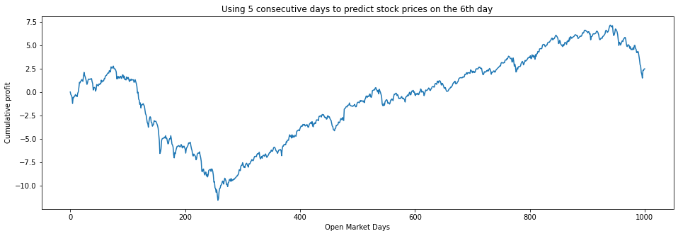
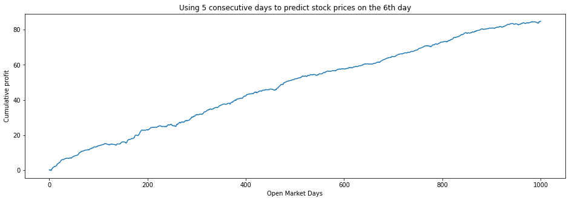
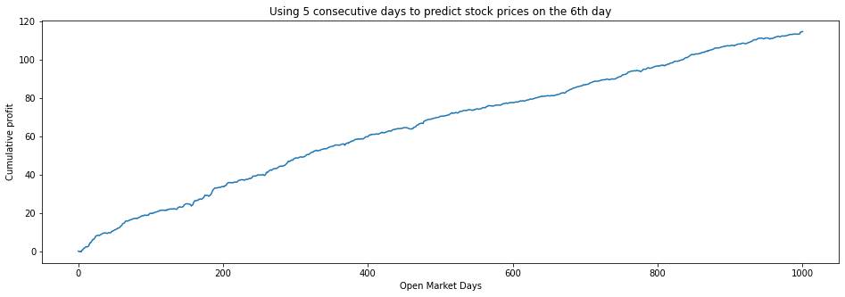
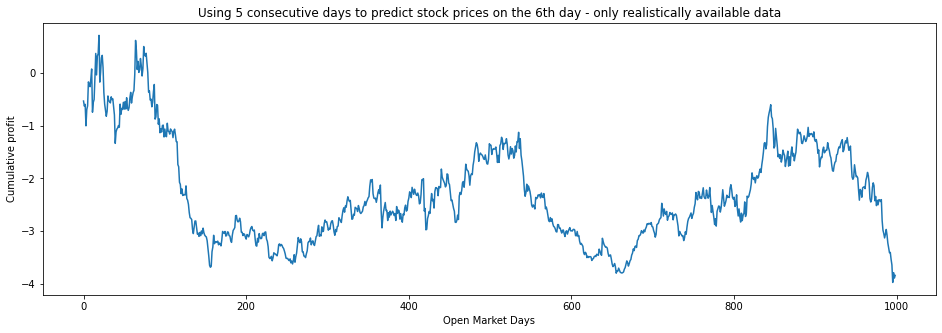

# Using deep learning to design a profitable trading strategy

The goal of this project is to use deep learning techniques to experiment how useful they can be for designing trading strategies. 

## Data

I will use daily market closing price for all my experiments. To maximize potential profits I will focus on volatile markets. According to investopedia energy sector was the most volatile sector so at least at the beginning I will focus on that. Additionally the volaility in energy sector was strongly downards. I think testing a buying strategy in a bearish market can really validate it. It's easy to make money by buying in bullish market and get a false impression that the strategy is sound but it's not that simple to make profit buying and later selling stocks in bearish market.

The data will be sourced from NASDAQ - the reason is that NASDAQ is dealer's market - the trades can be executed instantly which would favour algorithmic strategies. In each of my experiments I will describe what transformations I applied to the dataset. The benefit of focusing on limited sectors instead of the whole market or only single company is that intuitively I expect that performance of companies in one sector will affect performance of other companies in that sector too - whether due to the new available opportunities available to all or maybe competition between each other. This means that input for these models will be daily price data of all companies in the sector - and the model will attempt to predict price behaviour of all these companies. The output will therefore be a vector of predicted prices for all these companies (or maybe later only a simple BUY/SELL signal for every one of these companies).

I used https://public.opendatasoft.com/explore/dataset/nasdaq-companies/table/?refine.sector=Energy to find NASDAQ tickers in the energy sector. For some tickers I couldn't find historical data, some went bankrupt and others were too young. I decided to exclude these tickers:

ZNWAA, KLREU, KLREW, WLB, EXXI, KLRE - I couldn't find historical data for these tickers

LGCYP, CDEVW, EVEP, MEMP, TESO, AHGP, LGCYO, SEV, ORIG, REXX - these went bankrupt before 2019 (or otherwise didn't have available price data after 2019)

LONE, CDEVW, TUSK, METC, CDEV, TPIC, XOG, SNDE, PVAC - these didn't exist before 2015 (or otherwise didn't have available price data before 2015)

For the remaining 43 tickers I managed to extract a block of contiguous price data from 1. 1. 2015 to 1. 1. 2019. List of these tickers will be enclosed in this repository together with their price data and corresponding date vector.

To prevent the network from being biased against cheaper stocks I normalized the data - rescaled price of every stock to [0,1] scale w.r. only to its own historical data. I did this by subtracting from each data point the minimum value in the time series and divided by the difference between the maximum and the minimum value in the time series.

## Strategy

The model will predict next day's closing stock prices based on previous 5 days stock prices. Our strategy is to buy stocks that the model predicts will increase in price - we buy 1 unit of value worth of every such stock.

## To do

- [x] Five day moving average buying strategy
- [x] Simple densely connected shallow regression network
- [x] Complex densely connected deep regression network
- [x] Simple densely connected classification network
- [x] Complex densely connected deep classification network
- [ ] Recurrent neural network
- [ ] Performance of all strategies in one graph

### Base case experiment: five day moving average

#### Model

This model is simple: take the average price of every stock of the past 5 days. If the average price is higher than the current stock price, buy the the stock and sell it the next day. If the average price is lower than its currrent price, don't do anything.

#### Results

### 1 Shallow densely connected network

#### Model

The model is a densely connected network with two hidden layers. Whether I used relu or tanh activation function didn't make difference in the outcome. Both of the hidden layers had 50 neurons each.

To train the model I used Adam optimizer with 0.01 learning rate, MSE loss function and 1000 learning epochs.

#### Results

To visualize performance of a strategy I decided to show cumulative profits from applying the strategy every day.

Following figure shows cumulative profits from applying a model that was trained on the full dataset. The MSE loss went down from 0.2 to 0.001. As expected, the model fits the data and the strategy reliably generates profit.

Of course it is impossible to train the network on future data. To see whether this model captures the underlying market pattern or if it simply memorizes the dataset I will train the model only on the first 500 days of the dataset and see to what extent it retains its performance.

It is clear now that the model overfits the dataset and as it is it can't predict stock prices in long-term. But what about short-term? What if we train the model on all data available (data of days before the day we want to predict)? This way I need to train one model for each day for which we want to make a prediction. Since I will need to train over 1000 models, I will train each only for 10 epochs.

This look like a random walk. The model as it is doesn't capture any meaningful pattern with the available data. It's output is seemingly random. Maybe if I let it train for full 1000 epochs it will capture the pattern more accurately.

The profits are identical in both cases.

### 2 Deep densely connected network

#### Model

Since the shallow model of 2 hidden layers each of 50 neurons didn't yield any interesting results, this time I will increase depth of the model and width of each layer. I will start with 7 layers, each with 100 neurons.

#### Results

In 1000 epochs the MSE went down from 0.2 to 0.002. Repeated experiments show that most of the times it converges to loss between 0.002 and 0.003. After some random initialisations of parameters it hits the loss plateau at 0.05 after only 100 epochs. To get loss similar to that in experiment #1 I found out it is necessary to decrease learning rate to 0.001 and by 4000th epoch the model training loss would finally reach 0.001.

This is the result of applying the trading strategy using my deep dense model:

The curve and the final profit are identical to that in experiment #1.

I wanted to see what the trading performance would look like after 5000 epochs of training with learning rate 0.001:

Again, the curve is similar - but the cumulative profit increased. I am certain it is just that the model is overfitting the data. 

To confirm it I will train the model (1000 epochs, 0.01 learning rate) only on the first 500 days and see whether the model retains its performance even in the days after.

Now it is confirmed that the model is again overfitting the data. I also wanted to see performance of a longer-trained model (5000 epochs, 0.001 learning rate) on the first 500 days:

It may seem that the cumulative profit curve seems smoother with the model trained on 5000 epochs but that's only because the profit is larger - to accomodate the larger range of cumulative profit, the plotting library squashes the graph which makes it seem smoother. One can easily see that the curve shapes are nearly identical.

Just like in previous experiment, I am not convinced yet that the model is completely useless. Perhaps overfitting on available data can be accurate in predicting short-term yet unavailable stock prices? Maybe training the deep model on 100 days and overfitting it will make it good at predicting stock prices on 101th day. This means I will have to train over 1000 models. This is the graph of cumulative profits of a strategy using my deep model trained on all realistically available data:

The result is interesting. The cumulative profit has much deeper minimum (-10) than it had when I was using the simpler, shallow model (-4) while the maximum is lower too (6 with the simpler model, 4 with the deep model). This seems to be because between the days 100 and 250 the model made more bad predictions. But then from day ~250 the strategy made a great recovery and reliably generated profits - until day ~950 where the negative profits drove the cumulative profit into negative again.

It may have been simply because the model doesn't capture any meaningful pattern and the results are a random walk. But it could also be the case that the model performs better with more data available - perhaps it captures a meaningful pattern but only if trained on at least 250 days. I don't have any data preceding the day 1 available so I can't test whether the performance between days 100 and 250 would improve. But I can train the model and test the strategy only on data following day 250 and see if the performance significantly decreases.

The performance seems unchaged. Lack of historical data didn't make any difference.

### 3 Simple densely connected classification network

Perhaps the reason why my regression-based models don't offer performance reasonably attributable to anything else but pure luck and randomness is because regression-based models will necessarily focus on predicting the exact future price instead of just making some profit and preventing losses. A successful trading strategy doesn't need to know the exact future price (as long as the strategy involves buying stocks and not various options). And there's no need to keep rigorously updating the model parameters for examples where it correctly predicts the stock price will rise but doesn't accurately predict by how much. That's why I decided to redefine the model as a classification problem.

Now the target values the model will try to predict are no longer float numbers. They are binary values where 1 signifies buy signal and 0 don't buy signal (I am hesitant to call it sell signal to allow some space for the possibility of a stock not being good candidate for either buying or selling - also the values between 0 and 1 can be interpreted as confidence that the stock will increase in price).

#### Model

This model is very similar to the original shallow model. The difference is the loss function. Since the redefined problem is now basically a multilabel classification problem I decided to go with BCEWithLogitsLoss function. This is a combination of sigmoid (logistic) function which maps the output to values between 0 and 1 and binary cross entropy loss function.

Training the model was more difficult than the previous ones. With Adam optimizer and learning rate 0.1 the loss would begin with 0.69 and converge to 0.67 after a few epochs. Setting learning rate to 0.01 helped to push loss further down but very slowly. By 10,000th epoch loss would be 0.53 and after that it would go lower even slower - by 50,000th epoch it would get to loss 0.5.

Thinking that the learning rate was perhaps still too large I set it to 0.001 - by 50,000th epoch loss would be 0.51.

SGD optimizer with learning rate 0.001 would only reach loss 0.68 by 50,000th iteration and 0.677 with learning rate 0.01. Learning rate 0.1 allowed it to reach loss 0.65. Setting any higher learning rates resulted in loss getting stuck somewhere around 0.54-0.57.

Adamax would keep consistently improving loss but very slowly and only with learning rate 0.01. By 50,000th iteration loss was 0.47.

It was strange how very slowly the loss was improving. Perhaps there was some way to adjust the optimizer parameters just enough to decrease loss. Instead I tried adjusting the model. Literature recommends to use relu activation function over tanh or sigmoid because it allegedly accelerate convergence of gradient descent. In my model I changed relu function to tanh function and suddenly, with Adam optimizer and learning rate 0.01, I managed to get loss 0.38 by 10,000th iteration and 0.25 by 50,000th iteration.

According to https://stackoverflow.com/questions/48849730/why-is-tanh-performing-better-than-relu-in-simple-neural-network this might be due to the effect of dropout on performance of relu. Relu performs better with dropout following the activation function while tanh does not.

#### Results

First I wanted to see performance of the strategy with model trained with Adam optimizer, 0.01 learning rate, tanh activation function and 1000 epochs of training which resulted in loss improvement from 0.69 to 0.62:

**UPDATE: models after this message are NOT trained or realistically available data despite what the titles of visualizations claim!**

Next I want to compare it with the same model but trained on 10,000 epochs where loss improved from 0.69 to 0.54:

Additionally I want to see what performance with loss of 0.25 looks like (50,000 epochs):

Clearly the daily profits get less volatile and higher with more learning epochs. The curves are very similar, they just get more sloped with more epochs. Now the question is whether the model captured any meaningful long term pattern, just like in previous experiments and I will train it only on first 500 days and see how it performs after that.

We can similar unfortunate behaviour as in the previous models. Just to be sure I want to see performance of a model trained on 10,000 epochs:

The performance after day 500 is identical in both cases.

**UPDATE: models after this message are really only trained or realistically available data**

The model may still be able to capture some short-term pattern. So like in my previous experiments for each day in the dataset I will train it on all preceding days and evaluate it on prediction of price movement the following day. For the moment I will train each model on 10 epochs only.

This is the performance after training each model for 100 epochs:

And 1000 epochs:

There are differences between models trained on 10 and 100 epochs but hardly any between those trained on 100 and 1000 epochs.

It should be noted that while regression model plunged deeply somewhere around day 150, classification model recovered much quicker. Both models experience losses after day 950. But between days 300 and 950 while the regression model was steadily generating profit, the classification model experienced short-term volatility but overall stagnation. That's especially interesting because the regression model closely resembles performance of naive 5-day moving average strategy while classification model does not.

Regression model reached maximum of accumulated profit of ~4 units and maximum losses of ~10 units, profits of classification model didn't escape bounds of ~-5 and ~1.5.

I have another idea. What if old data is negatively impacting performance of the model on new data? What if I trained the model only on last, say, 100 days? This is the result:

And this is when 200 preceding days are used to train the models:

Performance did improve with more days considered. It still doesn't generate positive profit.

Maybe the model is overfitting and I really need to use relu activation functions together with dropout layers - regardless of whether loss decreases by a lot or not. For these dropout models I will still use only 200 preceding days to train models. 

This model has 0.5 independent probability of disabling a channel:

This is strategy performance when the model uses dropout layers with 0.1 independent probability of disabling a channel.

It's interesting how lowering dropout probability improved performance with respect to both model with 0.5 dropout probability and the model without any dropout layers.

Finally, this model has even lower dropout probability (0.05):

It doesn't perform better than the one with higher dropout probability.

* combine strategies

### 4 Complex densely connected deep classification network

#### Model

Maybe the network in previous experiments wasn't complex enough to capture any useful pattern. And so as in the regression task I will increase complexity of the network and see how it performs. I won't reproduce all experiments from the shallow classification model section and instead focus on experiments that already went better than the others.

Just like before, they model will have 7 dense layers, 100 neurons each.

#### Results

It will be the best if I first compare classification loss of deep classification model to that of shallow classification model.

I adjusted the deep network to use tanh activation functions and trained it for 50,000 epochs using Adam optimizer and learning rate 0.01. According to previous experiments the loss should converge to about 0.25 from 0.69.

This model was trained and tested on the same data so it's surprising the model isn't profitable. The loss improvement was quicker than with the shallow model, it reached loss 0.49 in 700 epochs and loss 0.1 by 2,800th epoch. But after 8,200th epoch the the loss improvement reversed. It jumped to 0.77 and after 10,000th epoch it converged to loss of 0.68. It is using the same training parameters as the shallow network which makes this reversal surprising.

The most reasonable explanation is that as the network tries to overfit the data, at some point during gradient descent the parameter vector reaches extremely steep peak in the direction of its momentum, gets stuck on some very high plateu and the passage out is too narrow to escape.

I tried to adjust the learning rate for Adam optimizer and for SGD optimizer but while the former would always reverse it's loss improvement and get stuck, SGD would improve it's loss too slowly. Finally I found that Adamax with learning rate of 0.01 retained it's fast loss improvement while at the same time didn't suffer from loss improvement reversal! Performance of this model:

Supposedly Adamax outperforms Adam on problems with sparse parameter updates. I can't tell if this is true. The loss improvement is nearly 100% as it descends from 0.69 to 0.005.

Now I will test this model trained on first 500 days on all 1000+ days:

Not unexpected. Now I will train the model only on realistically available data until the day for which we want to predict the price movement, 10 epochs of training for each model:

And trained with 100 epochs each:

This looks very promising, now I will train it on 1000 epochs each:

This doesn't look that well. Either more epochs overfit the model or training on older data trip up predictions for farther future. Considering that in the first 100 and even 200 days the profit losses are significantly greater in the 1000-epoch model (~-6) than in the 100-epoch model (~-1), I don't think it's really the older data that causes the problems but rather overfitting.

I will add dropout layers after each hidden layer with 0.1 dropout probability, considered it improved  performanced by a lot in the shallow network model. And of course I will change the activation functions from tanh to relu.

This is the result of training on 100-epochs.

And this is the result of training on 1000-epochs.

The newly introduced dropout layer worsened the 100-epoch model performance but improved the 1000-epoch model performance. In the end the 100-epoch model without dropout performs the best.

## Conclusion

I am not surprised that I didn't find any model that could reliably generate positive profit. What is more surprising is that none of the models performed better than the base case strategy 5-day moving average. Surely the models could have developed its internal understanding of what a 5-day moving average is to compete - but they didn't. Was it for the lack of layers? Neurons in each layer? Difficult to tell. Even if we knew that the models could represent a 5-day moving average strategy, we know nothing about its learnability by our models.

Still, this doesn't convince me that it isn't possible to create deep models for profitable stock buying strategies. In my experiments I used only 4 years worth of market data and at that only from one stock market and only one sector out of many. I used only 43 tickers out of perhaps 2000 or 3000. Surely with more data available there must be some 

Future ideas: 

* predicting performance of a limited number of stocks from price data of different stocks
* instead of trading stocks I could develop models for trading options
* predicting large market growth and market crashes - not only individual stocks